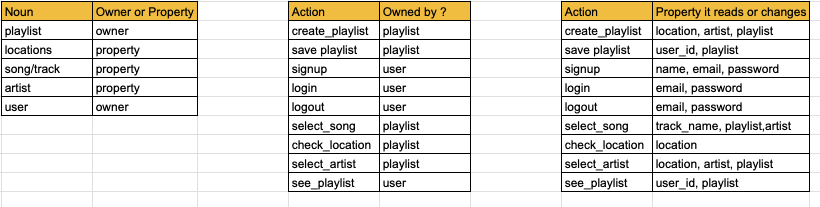

# Spotify Roadtrip


A react app that allows users to create custom playlists to accompany them on a roadtrip based on artists from the places they pass through. 


---------------------

## Planning
### Notes
- *MVP* - you can type in location and select the artists from that location and manually add their songs to a playlist

- *Progression 1* - Enter desired playlist length (in time or track number), and auto generates a playlist from multiple artist from that area.

- *Progression 2* - Manually enter in all the areas you are driving through -  app can auto generate a playlist with the top artists from those areas.
  
- *Progression 3* - Able to add 2 locations (journey start and end point) and app will create a route from A to B and select 'x' number of location points between A and B and autogenerate playlist based on artists from those places.

- *Progression 4* - User accounts: add backend so users can create personal account and save playlists/journeys for posterity. 

<br>

### User Stories

<br>

**MVP**

```
As a user, 
So that I can enjoy roadtrips
I would like to have a playlist created for me

As a user, 
So that I can have good music
I would like to be able to create playlist from selected artist from the locations I am driving through

As a user,
So I can be in touch with the location im in,
I can view the artists from that location
```

**Progression ideas:** 
```
As a user
So I can save these playlist, 
I would like to be able to sign up, log in and log out
```

### Domain Model



